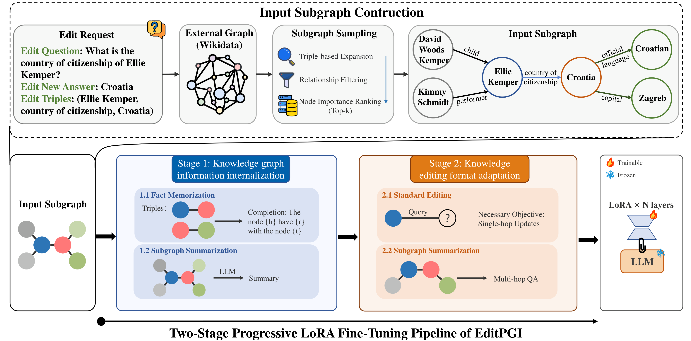

# MULTI-HOP KNOWLEDGE EDITING THROUGH IN-PARAMETER GRAPH INJECTION FOR LARGE LANGUAGE MODELS

This repository contains the code of our method **EditPGI**, which is built on EasyEdit with LoRA.

<p align="center">
  
</p>

## Repository Structure

```
ke-edit-pgi/
├── easyeditor/                # Core library
│   ├── editors/               # Main editing pipeline (editor.py, GNN.py, kga_llama_v3.py, ...)
│   ├── models/                # Implementations of editing methods (LoRA, MEMIT, ROME, ...)
│   ├── dataset/               # Dataset loaders (MQuAKE, KnowEdit, ...)
│   ├── evaluate/              # Evaluation utilities
│   ├── trainer/               # Training utilities
│   └── util/                  # Misc helpers
├── examples/                  # Entry scripts
│   ├── run_knowedit_llama2.py # Main script for MQuAKE knowledge editing
│   └── data/                  # MQuAKE benchmark and processed data files
├── hparams/                   # Hyperparameter configs for each editing method
│   └── LoRA/                  # LoRA configs (e.g. llama-7b)
├── steer/                     # Steering-related modules
├── figs/                      # Figures
├── tutorial-notebooks/        # Tutorial notebooks
├── requirements.txt
└── readme.md
```

### 1. Environment Setup

```shell
cd ke-edit-pgi
conda create -n editpgi python=3.10.3
conda activate editpgi
pip install -r requirements.txt
```


### 2. Benchmark

MQuAKE Benchmark (cite in our paper)


### 3. Knowledge Editing

```shell
cd examples
python run_knowedit_llama2.py     --editing_method=LoRA     --hparams_dir=../hparams/LoRA/llama-7b      --data_dir=./data/data/mquake_easyedit_3k_1_add_alias.json     --datatype='mquake' 

# 1 edited, 100 edited and all edited settings are adjusted through the variable '_sequential_edit' in file 'EasyEdit/examples/run_knowedit_llama2.py' and the variable 'chunk_size' in file 'EasyEdit/easyeditor/editors/editor.py':
```

|                  | 1 edited | 100 edited | all edited    |
| ---------------- | -------- | ---------- | ------------- |
| _sequential_edit | False    | True       | True          |
| chunk_size       | None     | 100        | len(requests) |